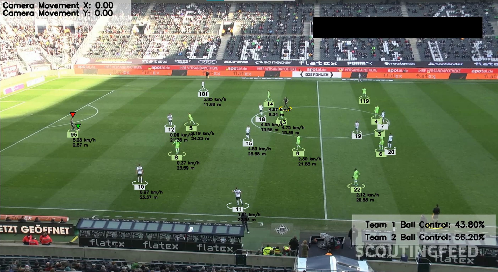

# Football Analysis Project

## Introduction
The goal of this project is to detect and track players, referees, and footballs in a video using YOLO, one of the best AI object detection models available. We will also train the model to improve its performance. Additionally, we will assign players to teams based on the colors of their t-shirts using Kmeans for pixel segmentation and clustering. With this information, we can measure a team's ball acquisition percentage in a match. We will also use optical flow to measure camera movement between frames, enabling us to accurately measure a player's movement. Furthermore, we will implement perspective transformation to represent the scene's depth and perspective, allowing us to measure a player's movement in meters rather than pixels. Finally, we will calculate a player's speed and the distance covered. This project covers various concepts and addresses real-world problems, making it suitable for both beginners and experienced machine learning engineers.

## Modules Used
The following modules are used in this project:
- YOLO: AI object detection model
- Kmeans: Pixel segmentation and clustering to detect t-shirt color
- Optical Flow: Measure camera movement
- Perspective Transformation: Represent scene depth and perspective
- Speed and distance calculation per player

## Trained Models
- [Trained Yolo v5](https://drive.google.com/file/d/1DC2kCygbBWUKheQ_9cFziCsYVSRw6axK/view?usp=sharing)

## Sample video
-  [Sample input video](https://drive.google.com/file/d/1t6agoqggZKx6thamUuPAIdN_1zR9v9S_/view?usp=sharing)

## Requirements
To run this project, you need to have the following requirements installed:
- Python 3.x
- ultralytics
- supervision
- OpenCV
- NumPy
- Matplotlib
- Pandas

Based on the detailed information provided in the sources, here is a professional title and corresponding description you can use for this project on your resume, emphasizing the technical depth and quantifiable results. This project is noted to "make your resume shine".

***

### Project Title

**AI/ML Football Match Analysis System (YOLO, Advanced Computer Vision, and Tracking)**

***

### Project Description

This comprehensive AI/ML project delivers detailed football (soccer) match analysis by applying state-of-the-art object detection, tracking, and advanced computer vision techniques to video footage.

**Key Features and Technical Contributions:**

*   **Object Detection and Tracking:** Developed and fine-tuned a custom **YOLOv5/V8** object detection model using the **Ultralytics** library to accurately identify and classify **players, referees, goalkeepers, and the football** across video frames. Implemented the **Byte Tracker** (via the Supervision library) to maintain persistent track IDs for players and objects throughout the match.
*   **Team Assignment via Clustering:** Assigned players to specific teams by analyzing and **segmenting player t-shirt colors** within their bounding boxes using **K-means clustering**.
*   **Precise Movement Compensation:** Employed **Optical Flow** to accurately measure and compensate for **camera movement** (e.g., pan and zoom), ensuring player movement calculations are robust and uncontaminated by camera artifacts.
*   **Real-World Perspective Transformation:** Utilized **Perspective Transformation** (View Transformer) to map pixel coordinates from the camera's distorted 2D viewpoint into **accurate real-world positions (in meters)**, addressing depth and perspective issues inherent in video capture.
*   **Statistical Analysis & Key Metrics:**
    *   Calculated **player speed in kilometers/hour** and **distance covered in meters** using the perspective-transformed, camera-adjusted positions.
    *   Measured and displayed **Team Ball Acquisition Percentage** by determining which player had possession of the ball (based on foot proximity) in each frame.
*   **Data Handling and Visualization:** Used **OpenCV (CV2)** for video reading, saving, and drawing custom annotations (circles, triangles, speed labels). Managed large-scale tracking data and handled missing ball detections through **Pandas interpolation**.
